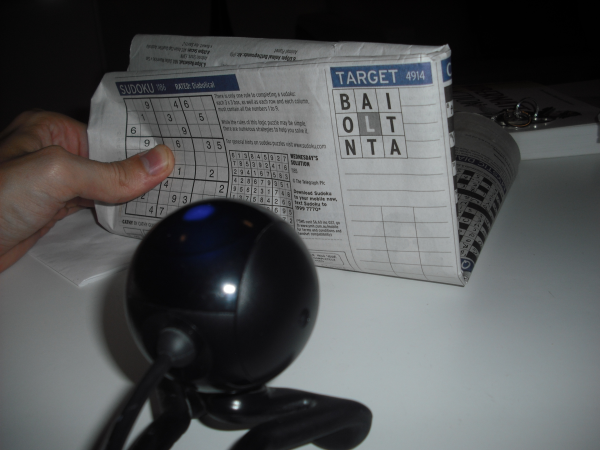
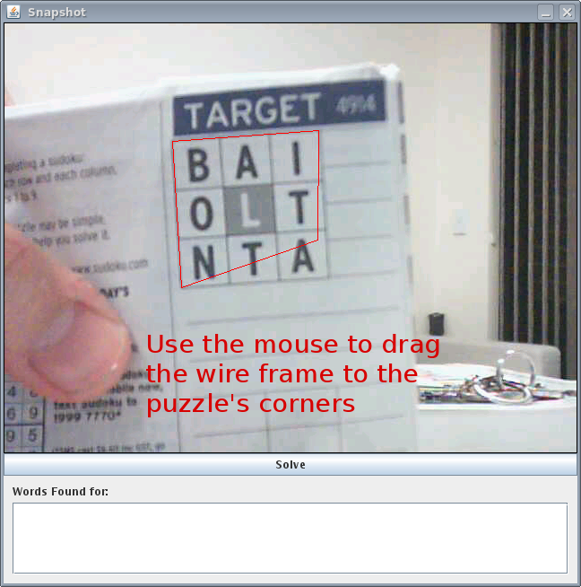
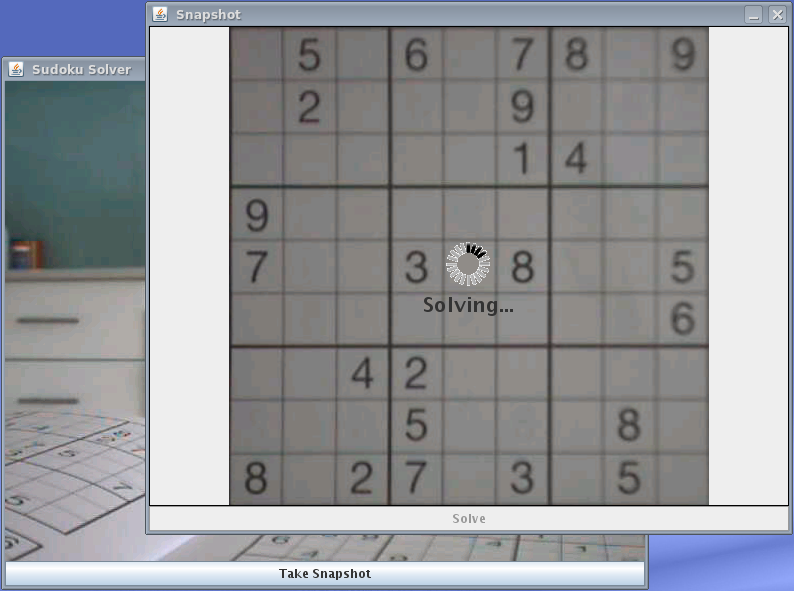
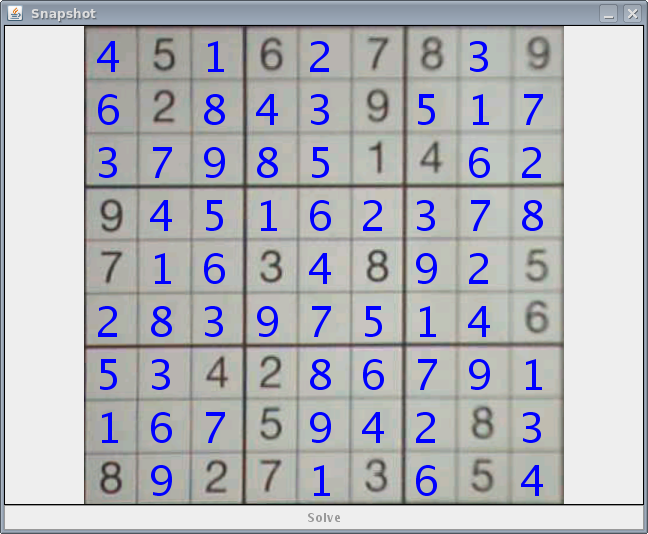
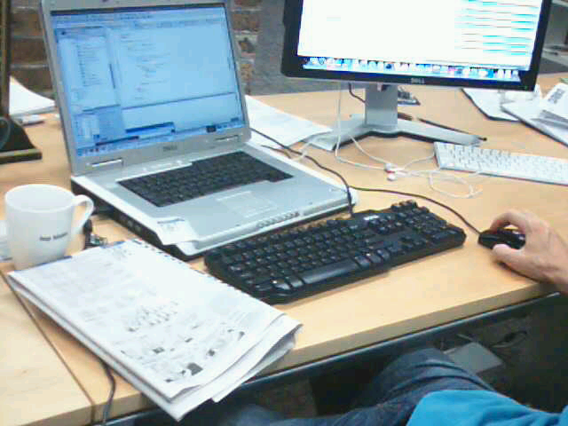
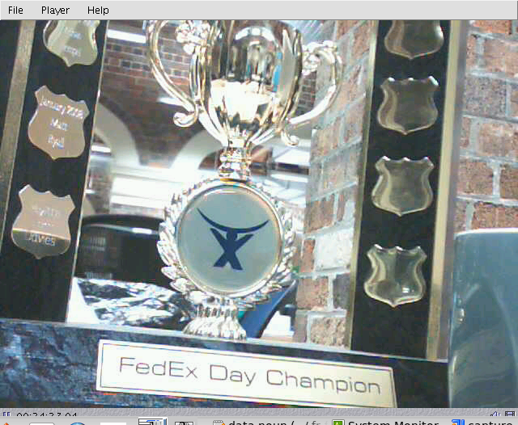

# CamSudoku / CamWord

This repo contains an old project that would use a homegrown Java OCR
implementation to solve Sudoku's and anagram puzzles from the Sydney
Morning Herald newspaper by holding it up to a webcam.

After it took a photo of the newspaper you would draw a bounding box
around the puzzle:

And it would OCR the puzzle, solve it and overlay the solution on top
of the photo:

The project won the FedEx competition, Atlassian's internal 2 day
hackathon in 2008.

